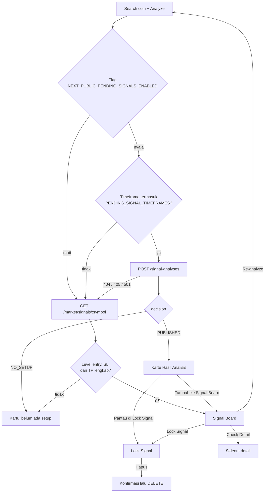

# Alur Signal di Dashboard

Tanggal: 22 September 2026
Status: menggambarkan implementasi yang berjalan di branch `development`

## Tujuan

Dashboard punya tiga daftar signal yang berdiri sendiri dan gampang tertukar. Dokumen ini memetakan ke mana hasil analisis pergi setelah setiap tombol ditekan, supaya tidak ada lagi yang mencari kartu di daftar yang salah.

## Tiga daftar, tiga peran

| Daftar | Judul di layar | Isinya | Sumber data |
| --- | --- | --- | --- |
| Lock Signal | "Rencana yang diikuti" | Rencana yang dipantau backend untuk akun ini | `GET /signals/locked` |
| Hasil Analisis | "Rencana Trading" | Rencana pending hasil Analyze, menunggu entry | Response `POST /signal-analyses` |
| Signal Board | "Signal Board" | Kartu kerja: scan market per timeframe + rencana yang dipindahkan ke sini | `GET /market/dashboard` + localStorage |

Urutan render dari atas ke bawah di [app/dashboard/page.jsx](../../../app/dashboard/page.jsx): ringkasan market → Lock Signal → tab board → form pencarian → Hasil Analisis → Signal Board.

Scam Pump Board adalah tab terpisah di sebelah Signal Board dan tidak berbagi data dengan ketiganya.

## Peta alur

## Alur 1: Analyze

Masuk lewat form `Search coin` di [CoinSearchForm.jsx](../../../app/dashboard/CoinSearchForm.jsx), diproses `runAnalysis` di [DashboardSignalWorkspace.jsx](../../../app/dashboard/DashboardSignalWorkspace.jsx).

Pemilihan endpoint ada di `requestAnalysis` ([lib/signals/api.js](../../../lib/signals/api.js)) dan turun bertingkat:

1. Flag `pendingSignals` mati → langsung endpoint lama.
2. Flag nyala tapi timeframe di luar `NEXT_PUBLIC_PENDING_SIGNAL_TIMEFRAMES` → endpoint lama.
3. Flag nyala dan timeframe dilayani → `POST /signal-analyses`. Kalau backend menjawab 404, 405, 501, atau 503 dengan kode `FEATURE_DISABLED`, turun lagi ke endpoint lama.

Kunci idempotensi tidak dikirim dari browser: backend menurunkannya sendiri dari symbol, timeframe, candle keputusan, dan pengguna.

Hasilnya dipisah `applyAnalysis`:

| Kondisi | Tujuan |
| --- | --- |
| Response lama dan levelnya lengkap | Langsung jadi kartu **Signal Board** |
| `decision: PUBLISHED` | Jadi kartu **Hasil Analisis** |
| `decision: NO_SETUP` | Kartu "belum ada setup", tidak masuk daftar mana pun |
| Response di luar kontrak | Toast error, tidak ada kartu |

Jadi dengan flag pending menyala, **Analyze tidak pernah langsung mengisi Signal Board**. Itu perilaku yang benar, bukan bug.

## Alur 2: Pantau di Lock Signal

Tombol lime di kartu Hasil Analisis. `handleLock` di [PendingSignalSection.jsx](../../../app/dashboard/signals/pending/PendingSignalSection.jsx) memanggil `POST /signals/locked` dengan `signalId` saja — level kiriman browser bukan sumber otoritatif.

Kartu hasilnya muncul di **Lock Signal**, bukan Signal Board. Tombolnya berubah jadi "Dipantau di Lock Signal" dan rencana itu ikut dipolling tiap 30 detik selama statusnya masih hidup.

Rencana tanpa `signalId` (hasil endpoint lama) tidak bisa di-lock dari sini; tombolnya mati dengan penjelasan di `title`.

## Alur 3: Tambah ke Signal Board

Tombol kedua di kartu Hasil Analisis, ditambahkan 22 September 2026.

`planToBoardSignal` di [lib/signals/board.js](../../../lib/signals/board.js) memetakan rencana ke bentuk kartu board: bias, entry (atau titik tengah zona), SL, TP1, TP2, harga observasi terakhir, RR, zona entry, serta risk dan reward dalam persen. Tidak ada request ke backend — semua datanya sudah ada di kartu.

Setelah ditambahkan, kartu pending **pindah**: hilang dari Hasil Analisis, ditandai di cache board supaya tidak muncul lagi setelah reload, dan hidup sebagai kartu Signal Board. Evaluasi backend atas rencana itu tetap jalan.

Kalau symbol-nya sudah ada di board, kartu lama ditimpa versi rencana ini.

**Batas yang diketahui:** rencana pending tidak membawa indikator, jadi RSI, EMA, dan Stoch RSI di kartu board tampil `-` sampai Re-analyze dijalankan dari Signal Board. Detail provenance rencana (analysisId, aturan trigger/fill, versi engine dan model, bobot tiap TP) tidak ikut pindah; yang tersedia di sideout hanya histori lifecycle.

## Alur 4: Di dalam Signal Board

Kartu board diisi dari tiga sumber, digabung `rebuildBoardSignals`:

1. `dashboard.signals` — scan market untuk timeframe aktif;
2. localStorage `dcms-dashboard-signal-board:<timeframe>` — kartu tambahan milik user;
3. hasil Analyze endpoint lama dan rencana yang dipindahkan dari Hasil Analisis.

Tiga tombol per kartu:

| Tombol | Aksi |
| --- | --- |
| Lock Signal | `POST /signals/locked`, kartu muncul di Lock Signal, label jadi "Dipantau" |
| Re-analyze | Analisis ulang symbol itu dengan cooldown, hasilnya menimpa kartu di tempat |
| Check Detail | Membuka sideout: narasi, decision summary, trade plan, confluence, dan histori lifecycle kalau rencananya punya `signalId` |

Ikon tong sampah di pojok kartu menghapus satu kartu, dengan Undo di toast. `Clear all signals` mengosongkan board, juga dengan Undo.

Symbol bawaan scan market yang dihapus diingat di `dcms-dashboard-signal-board:removed:<timeframe>` supaya tidak muncul lagi saat data berikutnya datang.

## Alur 5: Hapus dari Lock Signal

Tombol merah di kartu Lock Signal. Dikonfirmasi lewat dialog browser karena `DELETE /signals/locked/:id` permanen dan tidak bisa di-undo. Kegagalan ditampilkan sebagai pesan di dalam kartu, bukan ditelan diam-diam.

## Feature flag

| Flag | Default | Pengaruh |
| --- | --- | --- |
| `NEXT_PUBLIC_PENDING_SIGNALS_ENABLED` | mati | Menyalakan alur `POST /signal-analyses` dan kartu Hasil Analisis |
| `NEXT_PUBLIC_PENDING_SIGNAL_TIMEFRAMES` | `15m,1h` | Timeframe yang dilayani engine pending; di luar itu pakai endpoint lama |
| `NEXT_PUBLIC_PENDING_SIGNALS_PREVIEW` | mati | Mengisi Hasil Analisis dengan fixture sintetis untuk tinjauan UI tanpa backend |
| `NEXT_PUBLIC_SIGNAL_ASSESSMENT_ENABLED` | mati | Menampilkan penilaian model sebagai rekomendasi publik |
| `NEXT_PUBLIC_SIGNAL_POLL_INTERVAL_MS` | `30000` | Jarak polling status rencana pending |
| `NEXT_PUBLIC_SIGNAL_STALE_AFTER_MS` | `180000` | Ambang kartu ditandai "Data tertunda" |

Dengan seluruh flag pada default, dashboard berjalan di alur lama: Analyze langsung mengisi Signal Board dan Hasil Analisis tidak pernah muncul.

## Penyimpanan lokal

| Kunci | Isi |
| --- | --- |
| `dcms-dashboard-signal-board:<timeframe>` | Kartu Signal Board di luar hasil scan market |
| `dcms-dashboard-signal-board:removed:<timeframe>` | Symbol scan market yang dihapus user |
| `dcms-dashboard-signal-board:v2:<timeframe>` | Identitas kartu pending yang sudah dipindahkan atau ditutup |

Semuanya per timeframe dan per browser. Ketiganya berbagi prefix yang sama tapi dipakai dua modul berbeda: dua kunci pertama dipegang workspace untuk isi Signal Board, kunci `v2` dipegang `lib/signals/storage` untuk kartu pending. Saat dashboard dibuka, `migrateBoardCache` mengisi kunci `v2` dari dua kunci lama kalau belum ada.

Cache hanya menyimpan identitas dan preferensi kartu. Level rencana dan statusnya selalu dipulihkan dari server, tidak pernah dari cache browser. Kegagalan penulisan localStorage diabaikan supaya dashboard tetap jalan di mode privat.
